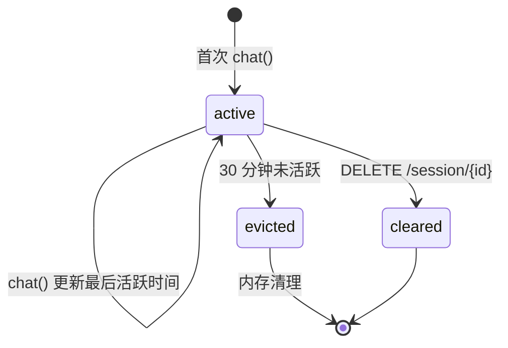

# SmartDoc 架构文档

| 版本 | 日期 | 说明 |
|------|------|------|
| V1.0 | 2026-06-06 | 初始版本 |

---

## 模块概览

```
smartdoc-common           ← 公共 DTO、枚举、API 响应包装
    ↑
smartdoc-chatModel        ← LLM 和 Embedding 的 Spring Bean 配置
    ↑
smartdoc-rag              ← 文档解析、分块、向量化、RAG 检索
    ↑
smartdoc-tools            ← Agent 可调用的 @Tool 工具（当前为 stub）
    ↑
smartdoc-chat             ← AiServices 装配、会话管理、Agent 接口
    ↑
smartdoc-api              ← 启动入口、REST 控制器、全局异常处理、CORS
```

依赖方向严格单向，禁止循环依赖。

---

## 各模块职责

### smartdoc-common

| 类 | 职责 |
|----|------|
| `AjaxResult<T>` | 统一 API 响应包装，含 `code`/`msg`/`data` 三个字段 |
| `ResultCodeEnum` | 状态码枚举（200/400/401/403/404/409/417/429/500/503/504） |
| `ProviderEnum` | LLM 供应商枚举（DeepSeek / Zhipu） |

### smartdoc-chatModel

| 类 | 职责 |
|----|------|
| `ChatModelConfig` | 配置并暴露 `ChatModel`（同步）和 `StreamingChatModel`（流式）的 Spring Bean |
| `ChatModelProperties` | 绑定 `llm.*` 配置属性 |
| `EmbeddingConfig` | 配置并暴露 `EmbeddingModel` 的 Spring Bean（支持 local ONNX / 远程 Zhipu 切换） |

### smartdoc-rag

| 类 | 职责 |
|----|------|
| `DocumentIngestionService` | 接收文件路径 → 选择 Parser → 解析 → 按配置分块 → 向量化 → 存入 `EmbeddingStore` |
| `RetrievalService` | 封装 `ContentRetriever`，供 Agent 在对话时检索相关文档片段 |
| `InMemoryEmbeddingStore` | 内存向量存储（重启丢失） |

### smartdoc-tools

| 类 | 职责 |
|----|------|
| `KnowledgeSearchTool` | `@Tool("根据关键词搜索知识库中的文档片段")` — 当前返回硬编码 mock 数据 |
| `TaskStatusTool` | `@Tool("查询任务或业务的办理状态")` — 当前返回硬编码 mock 数据 |

### smartdoc-chat

| 类 | 职责 |
|----|------|
| `ChatConfig` | AiServices 装配核心：将 ChatModel + StreamingChatModel + ContentRetriever + ChatMemoryProvider + Tools 组装为 `GeneralAssistant` |
| `ChatSessionManager` | 会话生命周期管理：ConcurrentHashMap 存储，滑动窗口 20 条消息，30 分钟未活跃自动清理 |
| `GeneralAssistant` | AI Service 接口定义，含 `@SystemMessage` 引用提示词文件 |

### smartdoc-api

| 类 | 职责 |
|----|------|
| `SmartDocApplication` | Spring Boot 启动入口，`@SpringBootApplication(scanBasePackages = "com.smartdoc")` + `@EnableScheduling` |
| `ChatController` | 对话 SSE 流式、历史查询、会话清除。含会话级并发锁 |
| `DocumentController` | 文档上传（含格式校验）、文档列表。格式校验返回 400，解析失败返回 500 |
| `AppConfig` | CORS 配置（全放通） |
| `GlobalExceptionHandler` | `@RestControllerAdvice` — 统一处理校验异常、文件过大、通用异常 |

---

## 核心数据流

### 对话流程

```
用户输入
  │
  ▼
ChatController.chat()
  │ 创建 SseEmitter(120s)
  │ 检查会话是否繁忙（并发锁）
  │ 提交异步任务到线程池
  ▼
GeneralAssistant (AiServices)
  │ 注入 System Prompt
  │ 从 ChatSessionManager 获取历史消息
  │ 从 RetrievalService 检索相关文档片段
  │ Agent 决定是否调用 Tool
  ▼
OpenAiStreamingChatModel
  │ 流式返回 token
  ▼
ChatController.onPartialResponse()
  │ 发送 SSE data:<token>
  ▼
前端 EventSource.onmessage()
```

### 文档上传流程

```
用户上传文件
  │
  ▼
DocumentController.uploadDocument()
  │ 格式校验（扩展名白名单）
  │ 文件大小校验（Spring 自动拦截）
  │ 文件名清洗（防路径遍历）
  │ 保存到 data/temp/
  ▼
DocumentIngestionService.ingestDocument()
  │ resolveParser() 选择 PDFBox / POI / Text
  │ FileSystemDocumentLoader 解析文件
  │ DocumentSplitter 按 1000 字符分块
  │ EmbeddingModel 向量化
  │ InMemoryEmbeddingStore 存储
  ▼
写入文档注册表 data/document-registry.txt
清理临时文件
返回 200 + 文档名
```

---

## 线程模型

| 线程池 | 配置 | 用途 |
|--------|------|------|
| SSE 对话线程池 | core=4, max=20, queue=200, CallerRunsPolicy | 处理 SSE 流式推送，防止阻塞 Tomcat 线程 |
| Tomcat 线程池 | Spring Boot 默认 | 处理 HTTP 请求 |

---

## 会话生命周期



- 检查间隔：每 5 分钟（可配置 `chat.eviction-interval-ms`）
- 超时时间：30 分钟（可配置 `chat.session-timeout-minutes`）
- 每个会话保留最多 20 条消息（可配置 `chat.max-memory-messages`）
